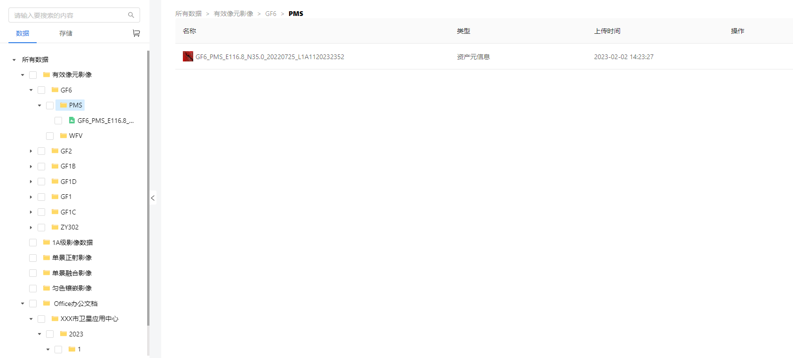
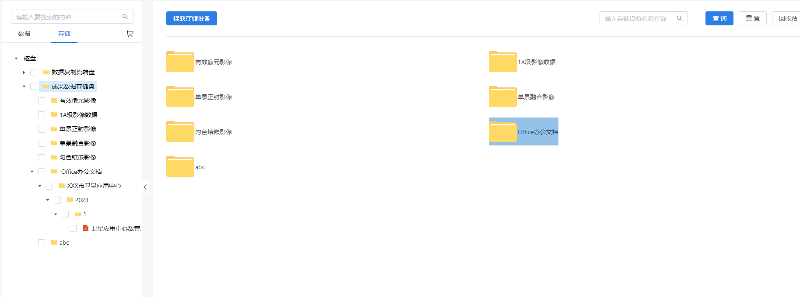
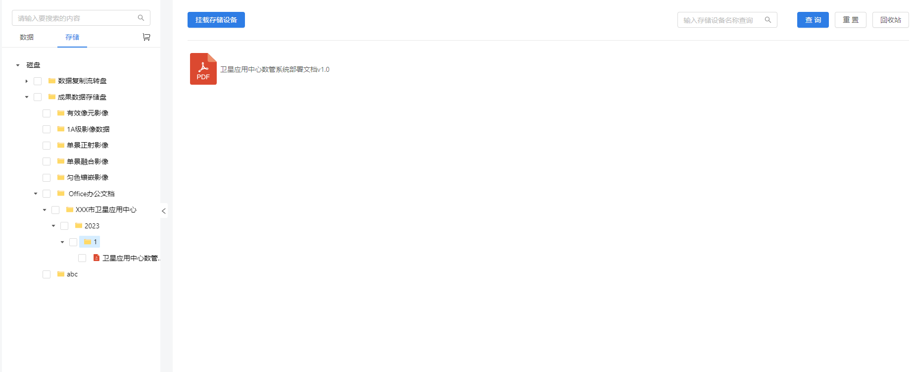

## React Class Component + antd 实现web端文件树以及windows风格的资源管理器

### 思路
1. 一切视图的渲染都应该是数据驱动的,制作较为复杂的UI时,也应该从'数据驱动'的核心触发,思考不同的视图和交互需要什么样的数据,以及如何把UI和交互所需的数据做最大程度的压缩和整合,放入React的状态中,驱动视图的变化和用户交互的副作用
2. 目录树一定是树结构,但是*树结构*的子节点是*对象数组*,控制文件资源浏览器视图的数据是*用户当前所在的目录的子节点对象数组*,那么上图视图的核心数据就是目录树数据和用户当前所想要浏览的目录节点对象的子节点数组.如下图所示
   
*唯一的难点就是前后端的配合(准确的说是后端的配合, 前端能否实现直接取决于后端对上述数据模型的实现,以及查询接口与交互的配合)*