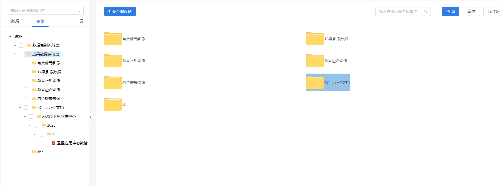

# 2023/1/19

## 年终随笔

### 项目经历

1. 影像数据生产任务监控、分发、管理系统-DMES(Data MES,数据生产MES系统)的重构和更新.
   2022/6/21 ~ 2022/10/15后续由研发组其他前端同事负责
   项目周期即贡献:
   第一阶段:代码架构调整。
   参与前端的基础设施的技术选型,参与前端代码重构架构设计
   第二阶段:业务逻辑实现与更新。
   按照新版本代码架构重新封装API层代码,规范组件名称,将组件式路由调整为递归函数生成的配置式路由。
   将旧版本的代码填充至新版本架构中。
   第三阶段测试与交付:
   修复Bug, 更新交互, 优化性能

   项目难点:
   1. 权限系统设计即权限系统前后端耦合:
      > 前端建立Purview权限的数据模型(类),用户首次登录时将用户的总权限值,与后端的权限码保持一致,在需要权限控制的交互/路由节点,增加权限控制,限制用户的UI和交互。
      > 单层权限无法满足需求后设计了多层权限,提出了"域"的概念,即将用户当前所在的路由位置映射为"系统"、"团队"、"项目"三个系统级别,不同域内权限列表不同,用户在三级域中有不同的权限系统,通过权限系统的分级实现更细致的权限控制。
      > 前端的配合手段就是利用sessionStorage存放用户当前的域,用户所在域变动时, 更新域, 发送请求时将域放入请求头, 与后端相配合
   2. 根据后端的JSON生成表单,动态的表单项,动态的校验规则:
      > 二次封装Form.Item组件,根据JSON递归生成Form.Item,
   3. 维护过程中,阅读AntV X6源码 优化由AntV X6编写的工艺流程图添加节点时的性能,理解其性能差距的来源,canvas模式与svg模式的不同,后续将X6升级为G6.
   4. 根据客户要求进行定制开发时需求的变动导致代码的变动,业务组件的可维护性至关重要,不停反思组件的封装思路,增强组件的可维护性,思考到底什么是真正的`敏捷开发`

2. 遥感影像轻型检索系统
   遥感影像检索、浏览、管理系统
   技术选型: 脚手架:customize-cra + react-app-rewired + cra 
            地图框架:leaflet
            UI框架: antd react
            状态管理工具: dva
   前端单人独立完成,封装‘数据驱动’风格的leaflet图层组件,原理:将图层列表数据用react的状态进行管理,灵活运用react 组件的生命周期,通过组件组合的方式来完成图层添加、删除一系列操作(副作用)和react状态的同步
   项目难点:
   1. 遥感影像数据模型(业务模型),中类型tif数据或者其他传统遥感数据中的元数据(metaData)的理解和数据模型的封装,定义MetaInfo 类,并封装提取Bounds的方法(用于图层外接矩形高亮或者定位等功能的实现),还要配合后端接口的设计,封装一系列的'工具'方法.
   2. 地图库Leaflet和react库配合使用时, 不断强化了对React设计中的"副作用"的理解 ,以及RFC hooks的理解有一定的要求,自此开始使用RFC作为自己开发组件的主要方式。
   3. google:xyz形式的地图服务,OGC标准的wmts,wms,wfs地图服务添加图层之前的预处理:要根据后端返回的元信息,来判断这个地理数据是以什么样的地图服务来添加到图层中,解析wmts,wms地图服务中的xml中的参数,在实例化图层的时候作为图层参数为图层增加属性(如中心点,加载范围,外接矩形)。

3. 地理大数据仓库管理平台,负责数据浏览模块。
   项目周期即贡献: 项目使用了umi脚手架 + dva(umi自带的状态管理)精简项目配置过程。使用微前端(qiankun)的开发模式,多个模块技术栈分离并独立开发,最终逐步集成。
   **业务方面**: 帮县级、市级、省级卫星应用中心的用户解决了矢量、遥感及描述文件或相关文档等空间大数据的管理、运转、出库入库效率低下,管理粗糙的问题。
   **团队合作**: 使用微前端架构,提升了开发效率和集成效率,研发速度加快。
   **业务实现方面**:数据浏览页面是文件目录+目录列表构成的 类似windows资源管理器的左右双栏布局,用户'当前所在目录'这一状态决定资源管理器面板列表的数据,这是实现目录和目录下文件列表的ui的数据驱动视图核心逻辑。
   </img>

### 未完成

对于一个稍有实践精神以及会阅读文档的人来说'怎么使用工具'或许是不那么重要或者困难的,"为什么工具被设计成这样,它解决了什么问题,他的核心机制是什么"反而更有意思,世界是变化的,探索变化过程中的不变的核心才是最重要的(当然在不影响团队合作进度的前提下去自由探索)
Flux架构到redux实践的历史沿革,摸清楚why it is the way it is.
> “why it is the way it is.” —— 《Speaking JavaScript: An In-Depth Guide for Programmers》Dr. Axel Rauschmayer
深入理解前端工程化
深入理解前端模块化(history and why and future)
js设计模式

### Inspiration

在回忆项目经历的时候有一种感觉: 作为产品研发团队的前端开发, 对于系统和业务产生思考之后,不禁会产生对于系统设计的疑问:

1. "系统设计真的合理吗,扩展性强吗?"

2. "这样的频繁改动设计的工作模式,前端的每次扩展或者更新进行起来是让人心神具疲?"

但是团队的重心往往都在后端,后端团队对业务进行抽象后提供数据操作接口,前端来实现视图和交互。往往这样一种开发体验: 前端已经做好了一个版本,建立了一些前端自己使用的数据模型和数据流,但是"在与业务逻辑及与其绑定的交互逻辑"实现后,整个小组发现这样的设计存在种种缺陷,不得不改动设计,但是系统设计变动(一定程度上)对后端代码结构的"破坏"应该远远没有其对前端数据模型和数据流方案的"破坏"来的严重。
造成这种"前端代码迭代困难,维护困难"的根本原因我认为就是:
   1. 前端的组件的实现与业务模型解耦没有做好。
   耦合与抽象是天秤的两端,耦合太重一般是由于抽象不到位,我们在写"业务逻辑组件"的时候,即由业务模型对应的数据和交互设计,抽象出核心状态,去后端提供的接口的数据中拿数据来作为状态数据,编写组件代码。设计一改,那么状态和交互可能就要变动,组件代码必然要发生变动。因为状态,交互,视图(JSX) 三者之间存在耦合。**UI设计**决定了前端开发要用后端数据模型中的什么数据来建立"组件"这个 v = React.render(state) 中的state；**交互设计**决定了伴随用户交互而发生的 curState = sideEffect(preState,event)副作用的写法,两者合力决定了组件组合方式的设计。
   如果组件与业务逻辑和数据模型进行了绑定,每变动一次,都对组件做一次小的摧毁,最终状态混乱,数据流出现漏洞,维护困难,因为开发者无法弄清楚"当初这个组件/页面的数据流为什么这样设计,为什么这个数据流与现在的设计格格不入,当初的状态和组件设计不能实现现在的交互了"。
   为什么难以维护呢?就是因为封装业务逻辑的组件的时候"抽象程度"太低,内部硬编码太多,没有暴露交互和数据给父组件,将业务逻辑在子组件里全固定了:
   举个例子: 图层列表组件,本质是对象列表,那么核心抽象是"列表组件",将图层也作为一个抽象封装到这个组件中,一旦"图层"抽象做不好,比如没有考虑到图层的服务类型,图层用什么地图框架等等,那么图层列表的功能一经改变,图层列表的组件里面的一些状态设计就要改变,一次两次还好,可以采用打补丁的范式去添加状态添加逻辑代码,但是这样做的次数多了会混乱不堪。因为抽象不到位,必定导致从用户交互、请求参数拼接、状态管理这整条流程的代码的耦合,一处改动,处处改动。
   优化思路：
   应该让setState与逻辑代码处于同一层级, 他俩组成的整体与jsx解耦, 如何将jsx与业务逻辑解耦呢? 那就是封装组件的时候,只负责将dom交互的回调和一些抽象的逻辑以函数的形式暴露给父组件(使用它的组件),组件只负责将发生的用户交互暴露给使用者,而不自己实现某个交互去做什么事情,这样自己封装的组件就变成了一个事件监听和发布器,只负责将用户的交互传递给其他组件,由上层组件决定什么样的交互对应如何操作state如何驱动视图变化。
   这就需要开发者将组件分为"Smart Component"和"Dump Component"(这也不完全正确,我认为一个Dump组件也可以有自己的状态,比如说一个卡片列表中某个卡片的折叠和展开状态,这种仅在组件内部使用,不涉及横切面关注的状态也可以存在于Dump Component里面)
   将业务逻辑,和抽象的组件分离。列表就是列表而不是"xxx数据列表",只负责对数据模型的UI渲染与用户交互的回调函数的暴露("用户点击某一行数据"这个行为中的"点击"和"点击的这一行数据"暴露出去),业务的逻辑由父组件实现,防止相关的状态要跨组件共享。以图层列表为例,如果图层逻辑都在图层列表里,那么图层列表的兄弟组件要用到图层列表里的状态怎么办,兄弟组件要改变图层列表的状态怎么办?不要等到后期,升级功能了,然后再进行状态提升,再去考虑把状态抽到Dva里面去,那个时候代码就混乱不堪,会出现这样一种情况:"有部分状态在组件内部,还有部分状态在dva和父组件里面",**这样等于没有做任何封装,甚至比做了封装还要恐怖,比封装少了内聚,比不封装多了耦合程度**。react作为一个UI库核心思想就是数据驱动视图,视图通过交互来驱动数据的变化再进一步驱动视图变化,要人为做到将组件的交互做到最抽象,暴露足够的信息给回调函数,让可以灵活修改的回调函数来负责逻辑,以图层列表为例,对图层列表这个组件进行交互,那应当只暴露交互的类型和交互对应的数据是什么。然后在一个暴露的函数中去传递这个交互"要做什么"(一般是拼接参数发送请求,或者是单纯的改变组件的UI状态),这样设计变动的时候只要去改特定地方的代码,不用到处找代码。
   与其说"抽象"与"耦合" 不如说是暴露的"组件行为接口"太少,自定义灵活性太低。
   2. ~~产品设计流程有点问题,甚至开发走在设计前面。(我现在还没有资格讨论这一方向)~~

组件重构带来的心智负担,决定了前端工作的痛苦程度。

很显然,在前端天生弱势并且我个人大型工程经验不足的情况下,从干预设计的角度去解决迭代问题是不可能的,不如从自己前端的设计思路上优化自己,适应团队。